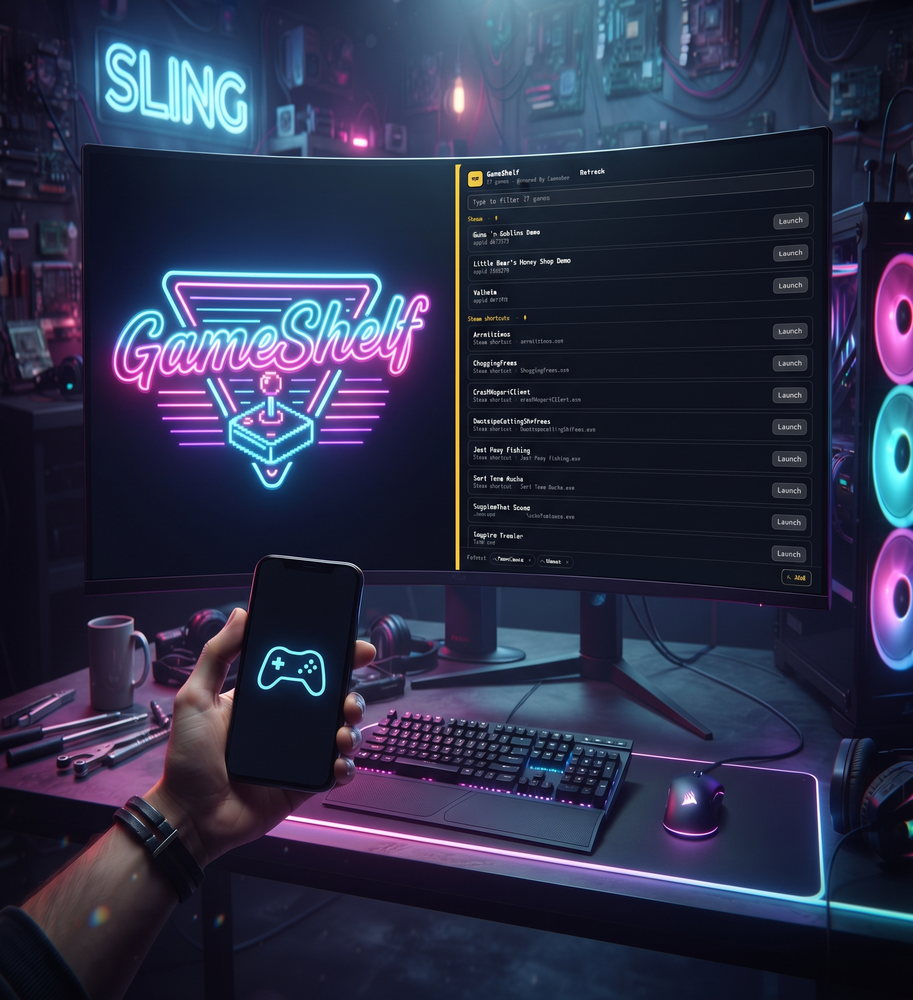

# GameShelf

One bar icon for every game on this machine — Steam (including the non-Steam
games you added to it), Lutris, Heroic, anything with a game entry in your
application menu, and any folder you point it at. Click the controller, type a
few letters, play.



[OmaGames](https://github.com/davidsmorais/omarchy-omagames) lists Omarchy *game
plugins*. A Steam, Lutris or Heroic library is not a plugin and can never appear
there. GameShelf is the other half: it reads the launchers themselves, plus plain
folders full of repacks, and starts the real games. The two sit happily side by
side — one icon for widget games, one for everything else.

## Install

```bash
omarchy plugin add https://github.com/alexwest1981/GameShelf --enable
```

From a clone instead:

```bash
bash install.sh              # copy into ~/.config/omarchy/plugins, validate, enable
bash install.sh --no-enable  # same, but leave it out of the bar
```

The repository owns the sources; the plugin folder is a build artifact, so run
`install.sh` again after `git pull`. Nothing needs root.

## Remove

```bash
omarchy plugin remove io.github.alexwest1981.gameshelf --yes
```

`omarchy plugin disable io.github.alexwest1981.gameshelf` only takes the icon out
of the bar and keeps the plugin installed. Settings live on the bar layout entry,
so removing the plugin removes them with it.

## Settings

Folders are picked in the panel: **Folders → + Add** opens a folder picker, and
the × on a chip takes that folder out again. The list is written to the bar
layout entry, so it lives with the widget and survives a reinstall. A folder
that is already listed (with or without a trailing slash) is not added twice.

Sources and hidden games are set on the command line, and `folders` still works
there too — for a script, or for a machine you are setting up over ssh:

```bash
omarchy bar set io.github.alexwest1981.gameshelf sources "steam,heroic,folders"   # drop lutris
omarchy bar set io.github.alexwest1981.gameshelf folders "~/Downloads,~/Games"    # same list as the panel
omarchy bar set io.github.alexwest1981.gameshelf hiddenIds "steam:892970"         # never list this one
```

| Key | Default | What it does |
|---|---|---|
| `sources` | `steam,shortcuts,lutris,heroic,desktop,folders` | Which launchers to scan, comma separated. |
| `folders` | `~/Downloads,~/Games` | Folders searched (three levels down) when `folders` is on. |
| `hiddenIds` | *(empty)* | Ids to hide. Ids are shown in the panel: `steam:892970`, `shortcut:123456`, `heroic:<app_name>`, `desktop:<entry>`, `file:/path/to/game`. |

The panel groups the list by where each game came from, so `sources` is also the
grouping: turn a launcher off and its section disappears.

With every source on the list is longer than the panel, so there is a filter
field under the header: type part of a name, a detail or a source and the
sections narrow to the matches (Escape empties the field, a second Escape closes
the panel).

## What it finds

| Source | Where it reads | How it starts |
|---|---|---|
| **Steam** | `appmanifest_*.acf` in every library listed in `libraryfolders.vdf` — other drives included — minus Proton and the Steam Linux Runtimes, which are not games | `steam://rungameid/<appid>` |
| **Steam shortcuts** | `userdata/<id>/config/shortcuts.vdf`: the non-Steam games you added to Steam by hand | `steam://rungameid/<shortcut appid>`, so Steam's own Proton setup runs them |
| **Lutris** | `~/.config/lutris/games/*.yml` | `lutris:rungame/<slug>` |
| **Heroic** | side-loaded apps, Epic (`legendary`) and GOG libraries under `~/.config/heroic/` | the game's own executable, otherwise `heroic://launch/<runner>/<app_name>` |
| **Desktop** | `.desktop` entries with `Categories=Game` in `~/.local/share/applications`, `/usr/share/applications` and the Flatpak exports. Entries that are a front end for another library (Steam, Lutris, Heroic, Moonlight, Bottles, itch, RetroArch, Prism) are left to the source that owns their games | `gio launch <entry>` |
| **Folders** | one starter per folder: the native starter if there is one, then an AppImage, then the Wine starter; helper scripts and installers are skipped | the executable itself |

Steam, Lutris and Heroic each register a URI handler on a normal install, so
everything GameShelf does not own is started through `xdg-open`. One code path,
no per-launcher quoting, and no guessed command-line arguments.

The list is built when the panel opens, so a new install shows up without a
restart. Launching happens detached — the game keeps running if the panel closes.

## Manual scan and tests

The scanner is a standalone script; the widget and the panel both just run it.

```bash
python3 scan-games.py '{"sources":["steam","heroic","folders"],"folders":["~/Downloads"]}' | python3 -m json.tool
python3 scan-games.py --selftest   # builds a fixture tree: every source must find its game, and the noise must stay out
```

## Dependencies

- `python3` — standard library only, nothing to install.
- `xdg-open` and the URI handlers for `steam://`, `lutris://`, `heroic://` (each
  launcher ships its own `.desktop` handler).
- The launchers themselves. GameShelf never calls Steam's, Lutris' or Heroic's
  APIs and never writes into their libraries — it only reads their manifest files.

## Known limits

- **One row per folder.** A repack shipping both `start.n.sh` and `start.e-w.sh`
  shows once, native preferred. A per-folder override is the fix if that ever
  guesses wrong.
- **`.exe` files are skipped.** A bare Windows executable needs a Wine prefix,
  which is Lutris' and Heroic's job, not a launcher's.
- **Epic and GOG libraries are read defensively** — neither was installed when
  this was written, so those branches are unverified until they hold a game.
- **A shortcut without an appid is skipped.** Steam writes one for every entry it
  has launched since 2022; an older entry has none, and there is nothing to
  start it with.
- **A `.desktop` entry that only runs `steam://rungameid/...` is not listed
  twice** — the Steam source already has it.
- Folder titles come from the directory name, so a folder called
  `Project.Zomboid-jc141` shows up as "Project Zomboid jc141".

## License

MIT — see [LICENSE](LICENSE).

Not affiliated with, sponsored by or endorsed by Omarchy, Steam, Valve, Lutris,
Heroic Games Launcher or OmaGames.
